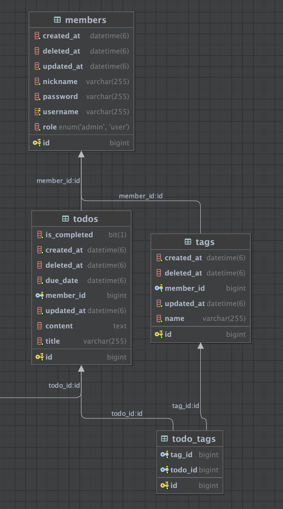

# todoworkspace

삼일피더블유씨엑셀러레이션 과제 전형입니다.

## 기술 스택

- **Language:** Java 17+
- **Framework:** Spring Boot 3.5.7
- **ORM:** Spring Data JPA / Hibernate
- **Database:** MySQL 8.0
- **Build Tool:** Gradle 8.x
- **Documentation:** Swagger/OpenAPI 3.0 (springdoc-openapi)
- **Validation:** Jakarta Validation API
- **Container:** Docker & Docker Compose
- **Dependencies:**
    - Lombok
    - MySQL Connector/J
    - Spring Boot Docker Compose

## 프로젝트 실행 방법

### 1. 사전 요구사항
- Java 17 이상
- Gradle 8.x
- Docker & Docker Compose

### 2.Docker Compose를 이용한 실행 방법

```bash
# 프로젝트 클론
git clone https://github.com/EwanJee/todoworkspace.git
cd todoworkspace

docker-compose up -d # 안되면 docker compose up -d

# 애플리케이션 실행
./gradlew bootRun
```

### 3. 서비스 접속
- **애플리케이션**: http://localhost:8080
- **Swagger UI**: http://localhost:8080/swagger-ui.html

### 4. 초기 더미 데이터 삽입
`src/main/resources/data.sql`
- 5명 Member
- 8개 Tag
- 10개의 Todo

## 다이어그램


## 구현된 기능

### 요구사항 완성

#### 1. ToDo CRUD 기능
- **생성**: POST `/api/v1/todos` - 새로운 ToDo 생성
- **조회**: 
  - GET `/api/v1/todos/{id}` - 단일 ToDo 조회
  - GET `/api/v1/todos` - 전체 ToDo 목록 조회 (필터링 지원)
- **수정**: PUT `/api/v1/todos/{id}` - ToDo 수정
- **삭제**: DELETE `/api/v1/todos/{id}` - ToDo 삭제 (Soft Delete)

#### 2. 사용자 구분
- ToDo 생성 시 Member와 연관관계 설정
- 각 ToDo는 생성한 사용자 정보 포함

#### 3. 태그 기능
- 태그를 통한 ToDo 카테고리 분류
- 여러 개의 태그 지정 가능
- 태그 자동 생성 및 연결

#### 4. 날짜 정보
- 생성일 (createdAt) - BaseEntity에서 자동 관리
- 마감일 (dueDate) - 사용자 지정
- D-Day 계산 (remainingDays) - 자동 계산

#### 5. 순서 변경
- PATCH `/api/v1/todos/{id}/priority` - priority 필드를 통한 순서 조정
- 기본 정렬: priority ASC, dueDate ASC

#### 6. 필터링 기능
- 사용자별 필터링 (memberId)
- 태그별 필터링 (tagName)
- 완료 여부 필터링 (isCompleted)
- 정렬 옵션:
  - priority (우선순위)
  - dueDate (마감일)
  - createdAt (생성일)

#### 7. 공유 기능
- Visibility 설정 (PUBLIC/PRIVATE)
- PUBLIC: 모든 사용자가 조회 가능
- PRIVATE: 작성자만 조회 가능

#### 8. 권한 관리
- 수정 권한: 작성자만 가능
- 삭제 권한: 작성자만 가능
- 조회 권한: PUBLIC이거나 작성자

### 고려사항 반영

#### 관리자 권한 정책
- 현재: 작성자만 수정/삭제 가능으로 구현
- 추후 관리자 정책 결정 시, Service 계층의 권한 체크 로직만 수정하면 됨
- 확장성을 고려한 구조 설계

#### Soft Delete
- BaseEntity에 deletedAt 필드 포함
- 삭제 시 deletedAt에 현재 시각 기록
- 모든 조회 쿼리에서 deletedAt IS NULL 조건 적용
- 추후 복구 기능 구현 시 deletedAt을 NULL로 변경하면 됨

## API 엔드포인트

### ToDo API

#### 1. ToDo 생성
```http
POST /api/v1/todos
Content-Type: application/json

{
  "memberId": 1,
  "title": "프로젝트 완성하기",
  "content": "ToDo 애플리케이션 완성",
  "dueDate": "2025-11-20T23:59:59",
  "tagNames": ["개발", "과제"],
  "visibility": "PUBLIC",
  "priority": 1
}
```

#### 2. ToDo 단건 조회
```http
GET /api/v1/todos/{id}?memberId=1
```

#### 3. ToDo 목록 조회 (필터링)
```http
GET /api/v1/todos?memberId=1&tagName=개발&isCompleted=false&sortBy=dueDate&sortOrder=asc
```

#### 4. ToDo 수정
```http
PUT /api/v1/todos/{id}
Content-Type: application/json

{
  "memberId": 1,
  "title": "수정된 제목",
  "content": "수정된 내용",
  "isCompleted": true,
  "dueDate": "2025-11-25T23:59:59",
  "tagNames": ["개발", "완료"],
  "visibility": "PRIVATE",
  "priority": 2
}
```

#### 5. ToDo 삭제
```http
DELETE /api/v1/todos/{id}?memberId=1
```

#### 6. ToDo 순서 변경
```http
PATCH /api/v1/todos/{id}/priority
Content-Type: application/json

{
  "memberId": 1,
  "priority": 5
}
```

## 프로젝트 구조

```
src/main/java/com/pwc/todoworkspace/
├── base/
│   └── BaseEntity.java              # 공통 필드 (createdAt, updatedAt, deletedAt)
├── configuration/
│   ├── JpaConfig.java              # JPA 설정
│   └── SwaggerConfig.java          # Swagger/OpenAPI 설정
├── error/
│   ├── CustomException.java        # 커스텀 예외 클래스
│   └── GlobalExceptionHandler.java # 전역 예외 처리
├── member/
│   ├── controller/
│   │   ├── MemberController.java
│   │   └── dto/
│   │       ├── RequestCreateMemberDto.java
│   │       └── ResponseCreateMemberDto.java
│   ├── entity/
│   │   ├── Member.java
│   │   └── enums/
│   │       ├── Department.java     # 부서 enum
│   │       └── Role.java           # USER, ADMIN
│   ├── repository/
│   │   └── MemberRepository.java
│   └── service/
│       ├── MemberService.java      # 인터페이스
│       └── impl/
│           └── MemberServiceImpl.java
├── tag/
│   ├── controller/
│   ├── entity/
│   │   └── Tag.java
│   ├── repository/
│   │   └── TagRepository.java
│   └── service/
└── todo/
    ├── controller/
    │   ├── TodoController.java
    │   └── dto/
    │       ├── RequestCreateTodoDto.java
    │       ├── RequestUpdateTodoDto.java
    │       ├── RequestTodoFilterDto.java
    │       ├── RequestUpdatePriorityDto.java
    │       ├── ResponseCreateTodoDto.java
    │       ├── ResponseTodoDto.java
    │       └── ResponseUpdateTodoDto.java
    ├── entity/
    │   ├── Todo.java
    │   ├── TodoTag.java            # Todo-Tag 다대다 관계
    │   └── enums/
    │       ├── Priority.java       # 우선순위 enum
    │       ├── SortOrder.java      # 정렬 순서 (ASC, DESC)
    │       └── Visibility.java     # PUBLIC, PRIVATE
    ├── mapper/
    │   └── TodoMapper.java         # Entity-DTO 변환
    ├── repository/
    │   ├── TodoRepository.java
    │   └── TodoTagRepository.java
    └── service/
        ├── TodoCreateService.java  # Todo 생성 서비스
        ├── TodoDeleteService.java  # Todo 삭제 서비스
        ├── TodoQueryService.java   # Todo 조회 서비스
        ├── TodoUpdateService.java  # Todo 수정 서비스
        └── impl/
            ├── TodoCreateServiceImpl.java
            ├── TodoDeleteServiceImpl.java
            ├── TodoQueryServiceImpl.java
            └── TodoUpdateServiceImpl.java
```

## 주요 설계 결정

### 1. Soft Delete 패턴
- 데이터 복구 요구사항을 고려하여 Soft Delete 적용
- BaseEntity에 deletedAt 필드 추가
- 모든 조회 쿼리에서 deletedAt IS NULL 조건 사용

### 2. Visibility를 통한 공유 기능
- PUBLIC: 모든 사용자가 조회 가능
- PRIVATE: 작성자만 조회 가능
- 읽기 전용 공유 요구사항 충족

### 3. Priority 기반 순서 관리
- Integer 타입으로 우선순위 관리
- 기본 정렬: priority ASC, dueDate ASC

### 4. 권한 체크 로직
- Service 계층에서 권한 검증
- isOwnedBy() 메서드로 소유권 확인
- 확장 가능한 구조 (관리자 권한 추가 용이)

### 5. Tag 시스템
- Tag는 Member별로 관리
- 이름이 같은 Tag는 재사용
- TodoTag 중간 테이블로 다대다 관계 구현

### 6. 계층별 예외 처리
- CustomException을 통한 일관된 예외 처리
- GlobalExceptionHandler로 전역 예외 처리
- Validation 실패 시 필드별 에러 메시지 반환

### 7. Mapper 패턴
- TodoMapper로 Entity-DTO 변환 로직 분리
- Service 계층의 책임 분리 및 재사용성 향상
- 단일 책임 원칙(SRP) 준수

### 8. 서비스 계층 분리
- TodoCreateService: Todo 생성 전용
- TodoQueryService: Todo 조회 전용
- TodoUpdateService: Todo 수정 전용
- TodoDeleteService: Todo 삭제 전용
- 명령과 조회 분리 (CQRS 패턴 적용)

## 리팩토링 및 코드 품질

### 적용된 리팩토링 기법

#### 1. 예외 처리 체계화
```java
// CustomException으로 공통 예외 처리
public class CustomException extends RuntimeException {
    public CustomException(String message) {
        super(message);
    }
}
```

#### 2. 서비스 계층 분리 (CQRS 패턴)
```java
// Before: 하나의 거대한 TodoService
public class TodoServiceImpl implements TodoService {
    public ResponseTodoDto createTodo(...) { ... }
    public ResponseTodoDto getTodo(...) { ... }
    public List<ResponseTodoDto> getTodos(...) { ... }
    public ResponseTodoDto updateTodo(...) { ... }
    public void deleteTodo(...) { ... }
}

// After: 목적별로 분리된 서비스
@Service
public class TodoCreateServiceImpl implements TodoCreateService {
    public ResponseCreateTodoDto createTodo(...) { ... }
}

@Service
public class TodoQueryServiceImpl implements TodoQueryService {
    public ResponseTodoDto getTodo(...) { ... }
    public List<ResponseTodoDto> getTodos(...) { ... }
}

@Service
public class TodoUpdateServiceImpl implements TodoUpdateService {
    public ResponseUpdateTodoDto updateTodo(...) { ... }
    public void updatePriority(...) { ... }
}

@Service
public class TodoDeleteServiceImpl implements TodoDeleteService {
    public void deleteTodo(...) { ... }
}
```

#### 3. DTO 변환 로직 분리 (Mapper 패턴)
```java
@Component
public class TodoMapper {
    public ResponseTodoDto toResponseDto(Todo todo) { ... }
    public List<ResponseTodoDto> toResponseDtoList(List<Todo> todos) { ... }
}
```

## 코드 컨벤션

### 1. 어노테이션 순서

#### ENTITY 클래스

```java
@Entity
@Table(name = "todos")
@Getter
```

#### Service 클래스

```java
@Service
@RequiredArgsConstructor
@Transactional(readOnly = true)
```

#### Controller 클래스

```java
@RestController
@RequestMapping("/api/v1/{resource}")
@Tag(name = "스웨거", description = "스웨거 API")
@RequiredArgsConstructor
```

### 2. DTO 클래스 네이밍
- 예시) RequestMemberDto와 같이 Request + {Entity 이름} + Dto 형태로 네이밍
- Response DTO도 동일하게 적용
